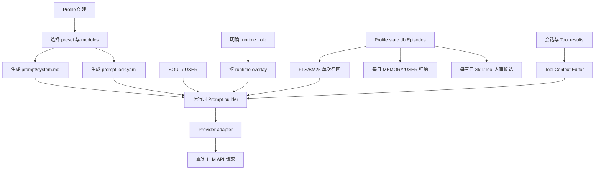

# PRD：Hermes Prompt 与上下文治理 v1

> 2026-07-29 架构修订：本文件中“Research parent 禁止直接检索”“正常任务固定
> 三 leaf”以及基于 Profile/工具名的 Harness 硬拦截已废止。工具可调用性以
> Profile allowlist、真实 ACL、approval 与 secret scope 为准。Research parent
> 可直接取材，只有存在独立证据面且并行有明确收益时才按需委派；Research 向
> Lingjun 返回整合后的 evidence dossier，由 Lingjun 保留最终分析与判断。

状态：Draft，待评审
范围：当前 Hermes 多 Profile 部署，以及以后通过 Profile Builder 新建的 Profile
更新时间：2026-07-27

## 1. 决策摘要

本 PRD 固化以下产品决策：

1. Hermes Gateway/Profile 会话不再自动读取工作目录中的 `AGENTS.md`。
   `/home/hermes/AGENTS.md` 继续只服务 Codex，不进入 Hermes 的 LLM 请求。
2. Kanban 无人值守协议只按明确的运行身份注入。普通交互会话即使能发现
   Kanban 工具，也不得收到 worker 协议。
3. 修复 Profile 根路径推导和 Prompt 块拼接；所有块使用明确边界，不再以空格
   粘连多个长提示词。
4. 增加 Provider 无关的 Tool Context Editor，在每次 LLM 请求前治理历史工具
   结果。采用 Anthropic Context Editing 语义：达到输入阈值才清最旧结果，
   保留最近工具窗口，且不回写破坏 canonical 客户端历史。
5. Prompt 模块只在创建 Profile 时组装，产物写入 Profile 并固化。运行时不做
   “场景二分类”或语义 Prompt 路由。
6. 沿用现有 Episode 提炼链，但将 Episode 和情景知识从 Mem0 迁移到本地、
   用户隔离的 SQLite 存储；v1 仅做确定性的关键词命中。
7. 对现有 `MEMORY.md` 做一次性清洗，并建立后续写入边界。动态基础设施事实
   只属于 shared-state。
8. Research 保留重型、多 Agent、宽 fan-out 的定位。治理对象是子 Agent 的
   Prompt 和回传接口，不削弱检索宽度、工具能力、迭代预算或原始证据。

## 2. 背景与当前问题

### 2.1 已确认的实现问题

- `agent/system_prompt.py` 会在未设置 `skip_context_files` 时调用
  `build_context_files_prompt()`。Gateway 的有效工作目录为 `/home/hermes`，
  因而 `/home/hermes/AGENTS.md` 会进入 Hermes Prompt。
- 非默认 Profile 的路径提示直接在当前 `get_hermes_home()` 后继续拼接
  `/profiles/<active>`。当 `HERMES_HOME` 已经是 Profile 目录时，会得到重复路径。
- `agent/system_prompt.py` 使用 `" ".join(tool_guidance)` 拼接多个长规则块，
  Markdown 标题和段落会在同一行粘连。
- `agent/agent_init.py` 以 `kanban_show` 是否出现在模型可见工具中判断是否注入
  完整 Kanban worker 协议。工具可见性不是运行身份，普通会话因此可能被误判。
- 现有 Tool result 清理只在整体上下文压缩时触发。它能对旧的大结果做一行摘要、
  精确去重和图片移除，但不会在每次 API 请求前淘汰已经失败、被重试取代或无效
  的结果。
- `delegate_task` 当前会将每个子 Agent 的总结直接回灌父上下文，默认单个上限
  24,000 字符。超限时采用 head/tail 截断并把全文落到缓存；它防止完全丢失，
  但没有提供面向研究综合的结构化证据接口。
- 现有 Episode 流程已经具备正确的基础边界：只处理结束会话、排除 cron 和
  subagent、按 `source + user_id` 生成不可逆 `subject_id`、验证 source hash、
  禁止 reasoning/system prompt，并以 `infer=false` 写入 Mem0。需要替换的是
  持久层和检索层，不应重写整个提炼逻辑。

### 2.2 产品层面的根因

当前系统把四类不同问题塞进同一段 System Prompt：

- Profile 的长期职责；
- 模型或平台兼容规则；
- 工具/运维权限边界；
- 某一次进程的执行协议。

结果是 Prompt 过宽、角色冲突、权限描述重复，并且只要工具列表或工作目录发生
变化，模型收到的职责也会意外变化。

## 3. 目标

### 3.1 用户目标

- 每个 Profile 只收到完成其职责所需的固定规则。
- 新建 Profile 时完成 Prompt 组装，此后不会因模型切换、目录变化或公共模板
  更新而静默改变。
- 普通会话、Kanban worker、controller、subagent、cron 的执行协议清晰分离。
- LLM 请求中不反复携带无价值的工具失败、重复页面、空结果或巨型原始输出。
- 情景知识能够从既有会话自动提炼、本地保存，并在关键词命中时按需出现。
- Research 继续以高并发、多来源、深检索为优势，同时避免三个子报告直接塞爆
  父上下文。
- 能够直接检查一次真实出站 LLM 请求，验证“最终到底发送了什么”。

### 3.2 工程目标

- Prompt 构建结果可重现、可哈希、可 diff、可回滚。
- 权限由工具暴露、ACL 和运行时校验强制执行，不依赖 Prompt 自律。
- 所有上下文裁剪在 Provider 适配层之前完成，并保持各 API 的消息配对合法。
- 迁移过程中不删除远端数据；切换失败时可以恢复现有路径。

## 4. 非目标

- 不在本 PRD 中治理 tool function/schema 注入；该问题由独立任务处理。
- 不在本 PRD 中修复会话级 Prompt 永久冻结；将其视为并行依赖。
- 不建设运行时语义场景分类器，不根据每条 user query 动态选择 Prompt 模块。
- v1 不做 embedding、向量库或 LLM 检索路由。
- 不恢复或增强 Hermes 的 coding 场景能力。本部署的 Profile Prompt 中删除
  coding 指导、代码仓库指导和环境探测指导。
- 不让 Profile memory 成为 shared-state 的副本。
- 不让 Episode 自动发布正式 Skill；现有三次成功 run 后进入人工审核的门槛保留。

## 5. 核心概念

- **Prompt module**：创建 Profile 时可选择的源模板片段。
- **Compiled profile prompt**：模块在创建时渲染出的固定文本，是运行时读取的
  Profile 职责 Prompt。
- **Prompt lock**：记录 preset、模块版本、内容 hash 和允许运行时 overlay 的
  清单。
- **Runtime overlay**：由明确进程状态决定的短协议，例如真实 Kanban worker。
  它不是语义路由。
- **Episode recall**：从 Profile `state.db` 直接检索并只注入当前请求的历史情景。
- **Evidence bundle**：Research leaf 保存在本地的完整报告、来源和证据。
- **Handoff envelope**：Research leaf 回给父 Agent 的结构化、有限长度摘要。

## 6. 产品需求

### 6.1 真实 LLM 请求可观测性

提供一次性、显式开启的出站请求快照能力，用于验证真实请求，而不是根据配置
推断。

要求：

- 快照位置在消息序列完成组装、Tool Context Editor 完成处理、Provider 适配
  即将序列化之前。
- 记录实际的 system/messages、tool schemas、model、temperature、max tokens、
  reasoning 参数和其他请求字段。
- 不记录 HTTP Authorization header。
- 快照文件 owner-only；默认关闭；支持 `once` 模式，成功捕获一条请求后自动
  关闭。
- 同时记录原始请求体的 SHA-256 和经过脱敏、适合人工查看的副本。若原始正文
  需要保留，必须是短期、显式、owner-only 的诊断产物。
- 快照标注每个上下文块的来源：compiled prompt、SOUL、USER、Episode、
  runtime overlay、history、tool result、tool schema。
- 提供只读检查命令，能按 Profile/session/request id 定位快照。

验收时必须使用 Lingjun、Companion、Research 各捕获一条真实请求，不能只跑
Prompt builder 单元测试。

### 6.2 禁止 Hermes 读取项目 `AGENTS.md`

新增 Profile/Gateway 专用配置：

```yaml
agent:
  context_files: false
```

行为：

- 新建 Profile 默认 `false`。
- 迁移后的现有 Profile 全部设为 `false`。
- 仅 Hermes 的 Profile/Gateway Prompt builder 使用该配置。
- 不修改、不移动 `/home/hermes/AGENTS.md`，不影响 Codex 对它的读取。
- `SOUL.md`、`USER.md`、Profile Prompt 和情景知识分别由自己的加载器管理，
  不借用通用项目规则扫描器。
- CLI 临时开发场景若确实需要项目规则，只能显式开启，不能继承 Gateway 的
  默认行为。

验收：

- Lingjun 和 Companion 的真实出站请求中不存在 `/home/hermes/AGENTS.md`
  内容。
- 在 `/home/hermes` 启动 Gateway 与从其他目录启动得到相同的固定 Profile Prompt。

### 6.3 Profile 路径修复

统一引入 canonical Hermes root：

- 若 `HERMES_HOME` 为 `.../profiles/<name>`，root 为其祖父目录；
- 否则 `HERMES_HOME` 自身为 root；
- Profile home 始终为 `root/profiles/<name>`；
- 默认 Profile home 始终为 root。

Prompt、文件安全校验、Profile 元数据和诊断输出共用同一个解析函数，禁止各自
拼字符串。

验收：

- 非默认 Profile Prompt 中不出现
  `profiles/<name>/profiles/<name>`。
- 默认 Profile、命名 Profile、clone 和 Gateway 启动的路径单元测试全部覆盖。

### 6.4 创建时组装并固化 Prompt

#### 6.4.1 文件产物

新建 Profile 时生成：

```text
~/.hermes/profiles/<name>/prompt/
├── system.md
└── prompt.lock.yaml
```

`system.md` 是完整的 compiled profile prompt。运行时直接读取它，不重新根据
当前模型、工具列表或 user query 组装职责模块。

`prompt.lock.yaml` 至少包含：

```yaml
schema_version: 1
preset: research
modules:
  - id: core-minimal
    version: 1
    sha256: "..."
  - id: research-parent
    version: 1
    sha256: "..."
compiled_sha256: "..."
runtime_overlays:
  - platform
  - kanban-worker
  - research-leaf
created_at: "..."
```

#### 6.4.2 固化语义

- 公共 module 更新不自动改写已有 Profile。
- clone 默认复制 compiled prompt 和 lock，保持行为一致。
- 提供显式的 `profile prompt diff`、`profile prompt verify` 和
  `profile prompt upgrade`。
- `upgrade` 必须先展示 diff，得到明确确认后才写入，并保留旧版本备份。
- 用户可继续编辑 `SOUL.md` 作为表达风格和人格层；职责规则不再混进 SOUL。
- 运行时模型切换不得改变 compiled prompt。
- 仅极小的 Provider 线协议兼容逻辑可留在代码侧；不得为不同模型追加大段通用
  英文行为规则。

#### 6.4.3 模块边界

源 module 只描述行为职责，不描述工具权限。权限和副作用边界由工具配置、ACL、
secret scope 和进程校验执行。

本部署不提供 coding module，且生成的 Profile 配置默认关闭：

```yaml
agent:
  coding_context: false
  environment_probe: false
  context_files: false
```

#### 6.4.4 Profile preset

| Profile | 创建时固化的主要模块 | 明确不包含 |
|---|---|---|
| default | `core-minimal` | coding、ops、research、Kanban worker |
| Lingjun | `core-minimal`、`controller`、`direct-action-minimal` | 通用 worker 长协议、动态基础设施、coding |
| Companion | `core-minimal`、`social-companion`、`media-delivery` | controller、ops、research、coding |
| Ops | `core-minimal`、`operations`、`change-boundaries` | 社交人设、research、coding |
| Research | `core-minimal`、`research-parent`、`citation-rigor` | coding、通用 ops、常驻 Kanban worker |
| XP | `core-minimal`、`resource-curation`、`active-retrieval` | delegation、外部发布、coding |

补充约束：

- Lingjun 的 controller 是长期职责；“worker/强执行”只保留一段短的直接行动
  原则。真正的无人值守 worker 协议由 runtime overlay 提供。
- Lingjun 的人设只润色表达，不承担权限说明或基础设施真相。
- XP 不 fan-out、不跨 Profile 分发，但必须保留并积极使用本地搜索、web、
  smart-search/xurl 等检索能力。

### 6.5 Prompt 拼接顺序与边界

出站上下文按以下顺序组装：

1. 极短的运行时/协议基础块；
2. `prompt/system.md`；
3. `SOUL.md`；
4. `USER.md`；
5. 平台格式 overlay；
6. 明确运行身份 overlay；
7. 命中的 Episode；
8. 会话历史；
9. Tool Context Editor 处理后的工具消息。

所有文本块使用 `"\n\n".join(...)`，每个块有独立来源标识；不允许使用空格连接
多个 Markdown 文档。

缓存要求：

- compiled prompt、SOUL、USER 的 hash 可独立观测。
- Episode recall 和进程 overlay 属于 volatile 区，不污染固定 Prompt hash。
- 会话冻结修复完成后，新会话读取当前 Profile 固化版本；旧会话的升级策略由
  冻结修复任务定义。

### 6.6 运行身份 overlay

运行身份来自启动器显式写入的枚举，不通过工具名或语义分类推断：

```text
interactive
kanban_controller
kanban_worker
subagent
cron
research_leaf
```

要求：

- `HERMES_KANBAN_TASK` 和经过校验的任务租约共同确认 `kanban_worker`。
- `kanban_show` 可见不能单独触发 worker overlay。
- controller overlay 只给实际 controller 进程；Lingjun 的长期 controller
  职责仍在其 compiled prompt 中。
- `research_leaf` 只由 `delegate_task` 创建时设置。
- cron 只注入短的无人交互和交付协议；具体任务参数留在 cron job 自身。
- 未识别或冲突状态 fail closed 为 `interactive`，并记录诊断告警。

### 6.7 Tool Context Editor

#### 6.7.1 位置

在每次 LLM API 调用前、Provider wire-format 转换前运行。它与整体上下文压缩
分离。默认配置值 `100,000` 是 `200,000`-token 有效输入窗口上的参考值；
运行时按 `context_length - max_output_tokens` 等比缩放，并封顶为整体
conversation compression 阈值的 75%，确保 Tool result 编辑先于整段压缩发生。

#### 6.7.2 保留策略

| Tool result 类型 | Provider 投影 |
|---|---|
| 尚未超过触发阈值 | 所有 Tool result 原样保留 |
| 最近 3 个 tool use/result 对 | 达到阈值后仍原样保留 |
| 更早的 Tool result | 按时间顺序替换为统一的已清理占位文本 |
| `exclude_tools` 命中的工具 | 不清理 |

默认 `clear_tool_inputs=false`：保留 assistant Tool call 输入，只替换对应 Tool
result 内容，从而维持 Chat Completions、Responses 和 Anthropic 三类 Provider
的合法配对。

#### 6.7.3 原始审计与压缩

- Canonical 会话内存和 `state.db.messages.content` 保留完整原始 Tool result；
  Context Editor 同时把短占位写入 nullable model-context projection sidecar。
  Gateway 新 turn 只在 live replay 使用 sidecar，浏览、导出、FTS 和审计仍读
  canonical 原文；同一 turn 则直接使用本次 Provider 投影。
- 大结果可额外进入 owner-only 的 session audit/artifact store，供审计或按需
  重读；该机制与 Provider 投影的统一占位文本分离。
- 摘要必须是确定性结构化摘要；只有大型复杂观测才允许调用低成本模型生成
  补充摘要。
- 编辑器输出计数：kept、dropped、deduplicated、superseded、receipts、
  artifact_refs 和节省字符/token 估算。
- 保留现有整体 compaction 作为更高层的长会话兜底。

该设计参考两类成熟行为：

- OpenAI compaction 允许调用方在 compaction 后丢弃更早的 items；
- Anthropic context editing 会清除旧 Tool result、保留最近窗口并用占位保持
  上下文可理解。

### 6.8 Profile state.db Episode

#### 6.8.1 Context trigger 与每日兜底

final assistant 与 canonical message 同一 SQLite 事务写入脱敏、有界的
`episode_extractions.input_json`，前台 Provider 路径不调用提炼模型。每日 22:15
按 Profile round-robin 租约消费 durable queue，并补发现历史完整 turn；单个
Profile 失败不阻塞其他 Profile，不依赖 session ended 或 message active 状态。

#### 6.8.2 本地存储

Episode 直接存入来源 Profile 的 `state.db`，与 canonical transcript 同库但
分表。默认只读当前 Profile；跨库读取必须同时通过
`episode_memory.read_scopes` 中的 Profile 与 subject 范围。

最小数据模型：

- `episodes`：结构化正文、retrieval text、keywords、subject、来源消息范围、
  source/body hash、outcome 和 extractor provenance；
- `episode_extractions`：持久化脱敏 input、pending/running 租约、
  succeeded/skipped/failed、attempt 和 bounded error；
- `episode_injections`：本次命中 Episode、来源 Profile、body hash、分数及
  prepared/sent/failed 发送状态。

唯一键为 session、首尾 message id 和 source hash；在线与每日路径通过同一 claim
事务幂等竞争。

#### 6.8.3 直接 Episode 召回

不调用 LLM、不使用 embedding：

1. 通过 Episode FTS5/BM25 查询 title、retrieval text 和 keywords；
2. FTS 不可用时使用有界 LIKE 回退；
3. 按 subject 和配置允许的 Profile 严格过滤；
4. 默认注入 top 3，合计最多 3,000 字符；
5. 只注入当前 Provider request sidecar 并进入实际 `api_content`，不持久化到
   canonical message。

每个命中块只标注 Episode id、更新时间和 body hash，方便审计，但不把原始
session id 发给 LLM。

#### 6.8.4 旧库迁移

旧 `user-context/context.db` Episode 以 source hash 幂等导入来源 Profile
`state.db`。旧库保留只读备份；运行时停用 Mem0 upload、shadow、Scenario Card
和 consolidation，不自动删除远端数据或凭据文件。

### 6.9 Episode 驱动的 Profile Markdown

五个 Profile 的 `state.db.episodes` 是 Hermes 内部自动归纳的唯一事实入口。
每日 22:15 在 Episode 补提炼之后，每个 Profile 最多处理 50 条 Episode，并以
`add/replace/remove/skip` 原子 operation 更新自己的 `MEMORY.md`（4,000 字符）
和 `USER.md`（3,000 字符）。

- 现有 Markdown 与前台 `memory` 写入登记为人工条目并受保护；
- 自动链只可替换或删除具有自动审计、且正文 hash 匹配的条目；
- USER 只接受配置的 owner subject，群内其他成员为 `excluded_by_policy`；
- 模型失败、非法 JSON、漂移或预算超限均不覆盖文件，保留状态供次日重试；
- 双文件更新使用固定锁顺序、原子替换和 crash journal；变化从下一个会话生效，
  不在当前长会话热重载。正文仍不写入 canonical message 或 `api_content`。

审计表为 `knowledge_distillations`、`memory_entry_audit` 与
`episode_knowledge_dispositions`。Lingjun 跨 Profile Episode 召回权限不适用于
归纳，各 Profile 只能写自己的 Markdown 和数据库。

### 6.10 Skill/Tool 学习候选与审批

每三日按 Profile 聚合 Episode。相似候选先以 FTS/BM25 预选，再由辅助模型做
merge/new/discard；不维护手写同义词 vocabulary。

- Skill：三个不同 source hash 且 outcome=success 才进入待审；
- Tool：工具名、状态、effect 与 digest 来自确定性 Tool receipt；两个独立
  Episode 或单 Episode 三次相同确定性失败才进入待审；
- ready 候选投递到 Telegram 运维话题 `11829`；
- Lingjun 的 `learning_review` 以 reviewer subject ACL、candidate ID、version
  和原子 lease claim 防止越权、并发重复应用及陈旧审批；
- cron 永不修改正式 Skill/Tool。批准后的同一前台 turn 走现有 provenance、
  ownership、approval 和最小验证流程，随后登记 applied/failed、目标 hash 和
  验证摘要。

普通 Mem0 每日同步保持为跨客户端高层用户记忆，不参与此候选链。

### 6.11 遗留 `MEMORY.md` 清洗

一次性迁移按以下分类处理：

| 内容类型 | 目标位置 |
|---|---|
| 用户明确且稳定的个人偏好 | USER 或用户情景知识层 |
| Profile 稳定职责/表达风格 | compiled prompt 或 SOUL |
| 多次成功验证的复用流程 | Skill 候选，仍需人工审核 |
| 动态网络、IP、端口、容器、服务状态 | shared-state |
| 一次性故障、临时路径、旧任务 id | 删除或仅留审计归档 |
| 未验证推测、过期 workaround | 删除 |
| secret、token、原始个人标识 | 不迁移并告警 |

动态基础设施迁移规则：

- 先在 shared-state 中读取并核对；
- 已有且一致时，删除 memory 副本；
- 不存在或冲突时，必须由有写权限的 ops 路径重新实测后写入；
- 不能把 memory 的旧值直接当成事实写入 shared-state；
- 清洗结束后生成分类计数和待人工确认清单。

后续写入防线：

- memory writer 拒绝明显的动态基础设施模式，如 IP/端口/容器瞬时状态；
- 提示调用 shared-state，但不自动越权写入；
- Research 的一次性 Kanban 事故和 `/tmp` workaround 不再进入长期 memory；
- XP 的资源索引应进入资源库/情景知识，不堆入无条件注入的 `MEMORY.md`。

### 6.10 Research：保留重型 fan-out，治理回传接口

#### 6.10.1 不削弱的能力

Research 必须继续保留：

- 默认最多 3 个并行 leaf；
- 每个 leaf 独立的模型迭代预算和完整研究工具；
- 多来源搜索、网页正文读取、交叉验证、矛盾发现和来源引用；
- 每个 leaf 在自己的上下文中进行深检索，不因父上下文预算而提前停止；
- 父 Agent 负责最终综合、去重、交叉验证和置信度判断。

本 PRD 不降低 fan-out 数、不缩短 leaf 最大迭代数，也不限制 leaf 原始报告长度。

#### 6.10.2 宽搜索、窄接口

每个 leaf 产生两份输出：

1. **Evidence bundle**：完整 Markdown/JSON 报告、本次搜索过的来源、关键摘录、
   冲突、失败和证据索引，保存在本地 artifact store；
2. **Handoff envelope**：回灌父上下文的结构化摘要，默认目标 8,000 字符，
   硬上限 12,000 字符，并受父上下文动态预算约束。

Handoff envelope 至少包含：

```yaml
question: "该 leaf 负责的问题"
answer: "结果优先的结论"
claims:
  - claim: "可验证主张"
    confidence: high|medium|low
    source_ids: [S1, S2]
contradictions: []
unexpected_findings: []
unresolved: []
source_index:
  - id: S1
    title: "..."
    url: "..."
artifact:
  id: "..."
  path: "..."
  sha256: "..."
  sections: ["sources", "evidence", "full-report"]
```

父 Agent 可按 claim、source 或 section 展开 artifact。不能只保留 head/tail
文本，因为中段可能正好包含矛盾或限定条件。

#### 6.10.3 Leaf Prompt

Research leaf 使用创建时固化的 `research-leaf` overlay，只包含：

- 子问题和边界；
- 来源质量、交叉验证和引用要求；
- Evidence bundle 与 Handoff envelope 输出契约；
- 允许报告意外发现和冲突。

不加载：

- Lingjun controller；
- 通用 Kanban worker；
- coding；
- Profile 的整份 USER/MEMORY；
- Skill 维护和基础设施权限说明。

需要用户背景时，由父 Agent 只传该子问题所需的最小事实。

#### 6.10.4 为什么不会失去重型 Research 的意义

重型 Research 的价值来自“并行算力、搜索覆盖、独立假设和证据质量”，不是来自
“把三个完整流水账同时塞进父上下文”。

结构化治理只压缩 fork-join 接口，不压缩 leaf 内部工作。为了避免结构过严导致
意外发现丢失，envelope 必须保留 `unexpected_findings`、`contradictions`、
`unresolved` 和可展开 artifact。最终效果应是：

- 获取面保持宽；
- 综合界面变窄；
- 原始证据可按需恢复；
- 父 Agent 有足够空间做真正的比较和综合。

### 6.11 XP 的个性边界

XP 固化为“不分发、积极检索”的资源管理 Profile：

- 禁止 `delegate_task` 和跨 Profile 任务分发；
- 保留并鼓励本地索引、session search、web、smart-search/xurl；
- 可整理、归类、去重和形成资源索引；
- 不向外部平台发布，不执行运维变更；
- 检索结果进入资源库或情景知识层，避免无条件进入 `MEMORY.md`。

## 7. 目标上下文结构



## 8. 迁移计划

### Phase 0：观测基线

- 为六个 Profile 记录 Prompt 字符/token、各来源块、工具结果占比和 Tool schema
  占比。
- 捕获 Lingjun、Companion、Research 各一条真实请求。
- 保存当前 Profile Prompt/SOUL/USER/MEMORY 和配置的只读快照。

### Phase 1：确定性错误修复

- 关闭 Gateway context file 扫描；
- 修 canonical Profile root；
- Prompt 块改为双换行拼接；
- runtime_role 显式化并修 Kanban gating；
- 加入请求快照和来源清单。

### Phase 2：Profile Prompt 固化

- 实现 module registry、preset、compiler 和 lock；
- 集成现有 Profile Builder/create endpoint；
- 为现有 default、Lingjun、Companion、Ops、Research、XP 生成迁移预览；
- 经逐 Profile diff 确认后切换。

### Phase 3：Tool Context Editor

- 使用 Anthropic-compatible Provider projection；
- 默认参考 `trigger=100,000 input_tokens @ 200,000 context`、
  `before_compression_ratio=0.75`、`keep=3 tool_uses`；
- 覆盖阈值前不清理、阈值后保留最近窗口、canonical 不回写和三类 Provider
  call/result 配对测试；
- 使用统一占位文本，并保留 artifact 引用和逐条审计报告作为内部元数据。

### Phase 4：Profile-local Episode 与知识归纳

- Episode 直接写入来源 Profile `state.db`，导入旧库并核对 hash；
- 召回切换为 FTS/BM25 单次 Provider projection；
- 每日归纳 `MEMORY.md/USER.md`，登记既有人工条目并启用 owner policy；
- 每三日聚合 Skill/Tool 人审候选，接入 Telegram 运维话题审批；
- 退役旧 Mem0 Episode/Scenario/turn-based consolidation，保留普通 Mem0 日同步
  与远端数据。

### Phase 5：Memory 清洗

- 生成只读分类报告；
- 对动态基础设施逐项与 shared-state 核对；
- 经确认后迁移/删除；
- 启用后续写入防线。

### Phase 6：Research fan-out

- 引入 Evidence bundle 和 Handoff envelope；
- 保留当前 3 并发和 leaf 迭代预算；
- 对真实重型研究任务做旧/新链路对照；
- 验证覆盖率不下降、父上下文显著下降且证据可展开。

## 9. 验收标准

### 9.1 Prompt 与 Profile

- 六个 Profile 均有可验证的 `prompt.lock.yaml` 和 compiled hash。
- 同一 Profile 切换模型后 compiled hash 不变。
- 普通 Lingjun/Companion 请求不含 Kanban worker 全协议。
- 真实 worker 请求包含一次且仅一次 worker overlay。
- Gateway 请求不含 `/home/hermes/AGENTS.md`。
- System Prompt 不含 coding 指导和重复 Profile 路径。
- 不存在两个 Markdown 块被空格粘连的情况。

### 9.2 Tool Context

- 每个 tool call/result 在三类 Provider API 上保持合法配对。
- 估算输入不超过当前模型解析出的有效 trigger 时，已消费结果仍原样进入下一次
  Provider 请求。
- 超过有效 trigger 时保留最近 3 个 tool use/result 对，只清更旧结果；有效
  trigger 必须按模型窗口等比缩放且早于 conversation compression 阈值。
- 默认保留 Tool call 输入；被清理的结果统一替换为短占位文本。
- Provider/model-context projection 不得覆盖 `state.db.messages.content` 中的
  canonical 原始结果。
- 每次阈值触发和清理决策可逐条解释。

### 9.3 本地知识

- Episode 日任务不再依赖 Mem0 网络或凭据。
- 本地 Episode 与迁移前远端数量/hash 对账通过。
- 不同 subject 的查询绝不互相返回。
- 无关键词命中时请求中没有 scenario block。
- 命中时最多 3 条、总计不超过 3,000 字符，并可追溯到 Episode 证据。
- 本地数据库不存在原始 transcript、system prompt、reasoning 和原始 user id。

### 9.4 Research

- 真实测试任务仍能启动 3 个并行 leaf。
- leaf 工具、迭代预算和原始 Evidence bundle 不因父上下文预算缩减。
- 每个 envelope 有来源索引、冲突、未决项、意外发现和 artifact hash。
- 父 Agent 可只展开指定 claim 的证据，不必加载整个 leaf 报告。
- 与旧链路相比，父上下文接收的 leaf 回传字符数至少下降 50%。
- 研究结论覆盖率和高质量独立来源数不得低于旧链路；若下降则不能上线。

## 10. 指标

每个 Profile/请求记录以下非敏感指标：

- system prompt 字符/token，按来源块拆分；
- tool schema 字符/token；
- history、tool result、Episode recall 字符/token；
- Tool Context Editor 各分类数量与节省量；
- compiled prompt hash 和 runtime overlay 枚举；
- Episode 命中数、候选数和注入字符数；
- Research fan-out 数、leaf 时长、来源数、envelope 字符、artifact 字符；
- Provider 400/上下文超限/compaction 次数。

不把 Prompt 正文、用户内容或 Tool 原始结果写入普通 metrics/log。

## 11. 风险与缓解

| 风险 | 缓解 |
|---|---|
| 固化后公共修复不能自动到达旧 Profile | `profile prompt diff/upgrade`，版本和 hash 可见 |
| Tool result 过早删除导致模型不知道发生过什么 | 至少消费一次；未解决 blocker 和 action receipt 保留 |
| 删除消息破坏 Provider 配对 | 在 Provider 转换前成对编辑，并做三套协议 conformance test |
| 关键词召回过少 | 支持短语别名、人工权重、命中诊断；v1 不引入隐式语义路由 |
| 关键词误命中 | subject/profile/status 过滤、top-k 和字符预算、可查看命中原因 |
| 本地 DB 成为新的无边界 memory | 结构化 schema、来源证据、有效期、人工覆盖和注入预算 |
| Research envelope 太窄丢失意外发现 | 保留专用字段和完整 artifact，父 Agent 可选择展开 |
| Memory 清洗把旧动态值当真 | 必须先从 shared-state 读取或由 ops 重新实测 |
| 迁移破坏正在进行的会话 | shadow/report-only、逐 Profile 切换、保留备份和回滚 |

## 12. 待评审但不阻塞原型的参数

以下采用推荐默认值进入原型，评审时可调整：

1. Episode 注入：top 3、总计 3,000 字符。
2. Research envelope：目标 8,000 字符、硬上限 12,000 字符/leaf。
3. 旧 Mem0 远端数据不自动删除。
4. Episode 采用 Profile `state.db` 本地存储；跨 Profile 读取必须显式授权。
5. 现有 Profile 的 Prompt 迁移只生成 diff，不自动覆盖。

## 13. 外部设计参考

- OpenAI Compaction：
  https://developers.openai.com/api/docs/guides/compaction
- Anthropic Context Editing：
  https://platform.claude.com/docs/en/build-with-claude/context-editing
- Anthropic Tool Context：
  https://platform.claude.com/docs/en/agents-and-tools/tool-use/manage-tool-context
